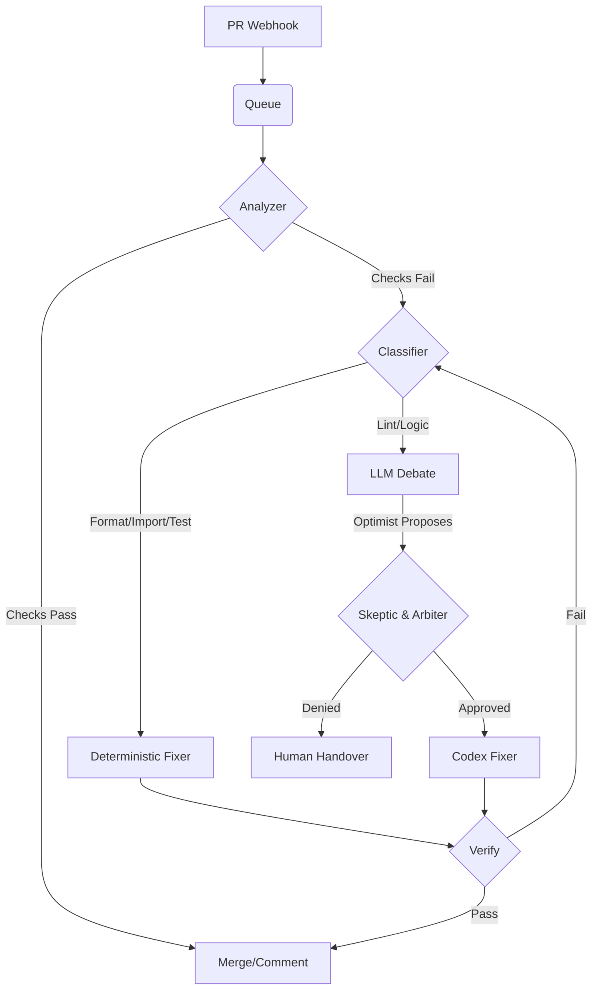

# Supervisor Coding Loop Status Report

**Date:** 2025-12-27
**Auditor:** Gemini Agent
**Scope:** Supervisor Loop (PR Review/Autofix)

## 1. Current State (TL;DR)
The Supervisor Coding Loop is **active and running**, with a hardened architecture incorporating deterministic fixers and an LLM debate layer.
- **Service Status:** UP (PID 1 inside container `pr-supervisor`).
- **Endpoints:** `/health` OK, `/api/diag` OK.
- **Tests:** 127 unit tests passed in container.
- **Configuration:** `push_enabled=true`, `dry_run=false`, but **`codex_available=false`**.
- **Critical Finding:** The system is in push-mode but reports Codex (LLM) as unavailable. This limits capabilities to deterministic fixers only; LLM-based lint fixes will fail or fallback.

## 2. Coding Loop Architecture
The loop follows a "Check -> Debate -> Fix -> Verify" cycle, orchestrated by `run_supervisor_job` in `src/supervisor/app.py`.



- **Deterministic Layer:** `src/supervisor/loop/fixers.py` handles formatting, imports, and targeted test re-runs (flake mitigation).
- **Debate Layer:** `src/supervisor/debate.py` and `src/supervisor/loop/` (Optimist/Skeptic/Arbiter) handle complex reasoning.
- **Execution:** `src/supervisor/runner.py` runs checks safely.

## 3. State Machine + Limits
**Stages (`JobStage`):**
- `RECEIVED` -> `ANALYZING` -> `DEBATING` -> `FIXING` -> `VERIFYING` -> `COMMENTING` -> `DONE`
- *Note:* `JobStatus` enum also exists (e.g., `FIX_LINT`, `FIX_FORMAT`) and serves as sub-states.

**Limits:**
- **Runtime:** `MAX_TOTAL_RUNTIME` (default 600s).
- **Attempts:**
  - `FIX_LINT`: Configurable (default `settings.max_loops`).
  - `FIX_FORMAT`: 3 attempts.
  - `FIX_IMPORT`: 3 attempts.
  - `FIX_TESTS`: 1 attempt.
- **Reason Codes:** `LOOP_LIMIT` is set when max attempts or runtime is exceeded.

## 4. Deterministic Fixers
Located in `src/supervisor/loop/fixers.py`.
- **Modes:**
  - `FORMAT`: `ruff format` + `ruff check`.
  - `IMPORT`: `ruff check --select I --fix`.
  - `TESTS`: Targeted `pytest` rerun (for flakes) or cleanup + full rerun.
- **Trigger:** Invoked when `Analyzer` detects relevant file changes or specific failure patterns.

## 5. LLM Debate Layer
- **Components:** Optimist (Proposer), Skeptic (Risk Analyst), Arbiter (Decision Maker).
- **Logic:**
  - `ArbiterDecision` determines `auto_fix_allowed`, `risk_level`, and `stop_reason`.
  - **Fallbacks:** If LLM fails (`LLMFailure`), system falls back to posting a comment and requesting human intervention.
- **Status:** Currently functional in code (`src/supervisor/debate.py`), but `codex_available=false` indicates it may not be operational in the current runtime environment.

## 6. Execution & Safety Gates
- **Gating:**
  - `autofix-ok` label required for push (logic in `check_autofix_policy`).
  - `SUPERVISOR_AUTOFIX_PUSH` env var controls global push capability.
- **Redaction:** Secrets are redacted from logs, comments, and API responses (`src/supervisor/redact.py`).
- **Diff Limits:** Checks `files_changed` and `total_loc_changed` against thresholds before committing.

## 7. Observability
- **Endpoints:**
  - `GET /health`: Service health.
  - `GET /api/diag`: Configuration and dependencies status.
  - `GET /api/jobs/{job_id}`: Job status, history, and redacted logs.
- **Logs:** Standard Python logging.
- **Notifications:** Telegram notifications enabled (`TelegramNotifier`).

## 8. Proof
**Service & Tests:**
```bash
$ docker ps --format '{{.Names}}'
pr-supervisor

$ docker exec -i pr-supervisor python3 -m pytest -q tests/supervisor
127 passed in 2.07s
```

**Endpoints:**
```bash
$ curl -s http://127.0.0.1:8080/health
{"ok":true,"enabled":true,"ready":true,"version":"0.2.0","error":null}

$ curl -s http://127.0.0.1:8080/api/diag
{
  "ok":true,
  "push_enabled":true,
  "dry_run":false,
  "codex_available":false,
  ...
}
```

## 9. Known Gaps / Risks
1.  **Codex Unavailable:** `codex_available=false` prevents LLM-based fixes.
2.  **GH CLI Dependency:** Drill scripts rely on `gh` which may not be present/authenticated in all environments.
3.  **Complex State Enum:** Overlap between `JobStage` and `JobStatus` may cause confusion in state tracking.
